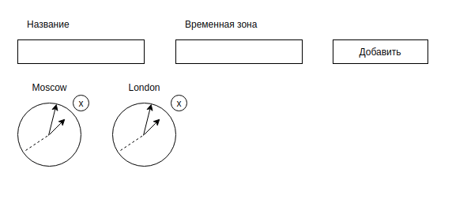

[ссылка на тестовый проект](https://mariza0.github.io/react-hw6-lifecycle-watches.git/) 

[ссылка на задание](https://github.com/netology-code/ra16-homeworks/tree/ra-51/lifecycle-http/watches)

Мировые часы
Наверняка вы видели в офисах многих компаний установленные часы, показывающие время в разных столицах мира:

New York,
Moscow,
London,
Tokyo.

Общая механика:

Вы заполняете поля «Название» и «Временная зона», указываете смещение в часах относительно Гринвича и нажимаете кнопку «Добавить».
Часы автоматически добавляются и, что самое важное, начинают тикать, то есть отсчитываются секунды, минуты и часы.
При нажатии на крестик рядом с часами часы автоматически удаляются, при этом все подписки — setTimeout, setInterval и другие — должны вычищаться в соответствующем методе жизненного цикла.
Упрощения: если вам сложно реализовать механику со стрелками через css — см. transform и rotate(), то вы можете сделать цифровые часы, где отображаются только цифры в формате: ЧЧ:ММ:СС.

Подсказки:

Посмотреть текущий TimezoneOffset вы можете, используя объект Date.
Можете использовать библиотеку Moment.js.
